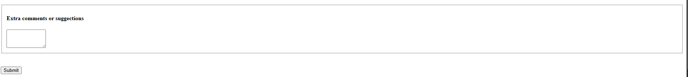

# Survey Form

## 📌 Project Description

This is a simple **HTML Survey Form** project that collects user information and feedback. It includes various input fields such as text inputs, radio buttons, checkboxes, a dropdown menu, and a textarea for additional comments.

The form is designed using basic HTML elements and grouped using `<fieldset>` for better structure and readability.

---





## 🛠️ Features

* User Name input field
* Email input field
* Optional Age input field
* Job selection dropdown
* Radio buttons for feedback
* Multiple checkboxes for improvement suggestions
* Textarea for extra comments
* Submit button

---

## 📂 Project Structure

```
survey-form/
│
├── index.html
└── README.md
```

---

## 🚀 How to Run

1. Download or clone the project.
2. Open the `index.html` file in any web browser.
3. Fill out the form and submit.

---

## 💡 Technologies Used

* HTML5

---

## 📈 Future Improvements

* Add CSS styling for better UI design
* Add form validation
* Make the form responsive
* Connect to a backend to store responses

---

## ✍️ Author

     AMRITHA MOHANAN

